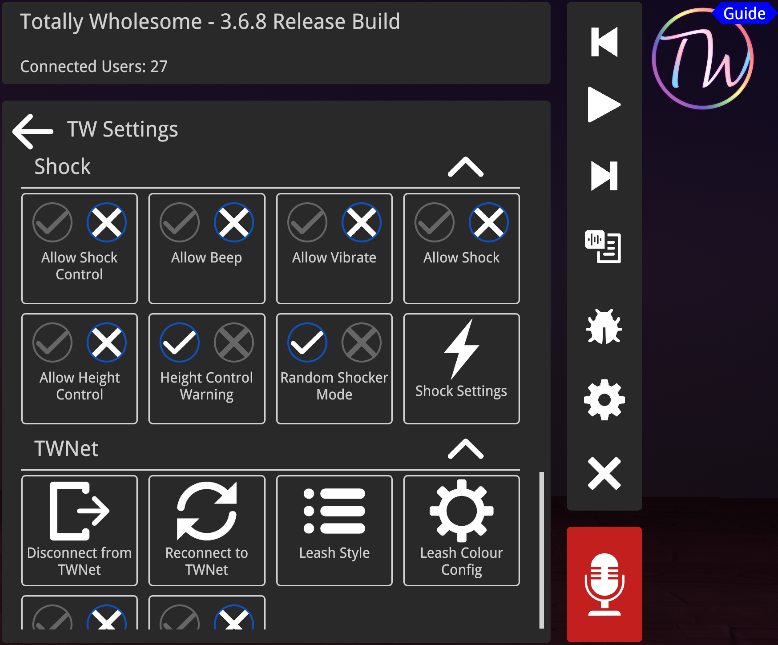
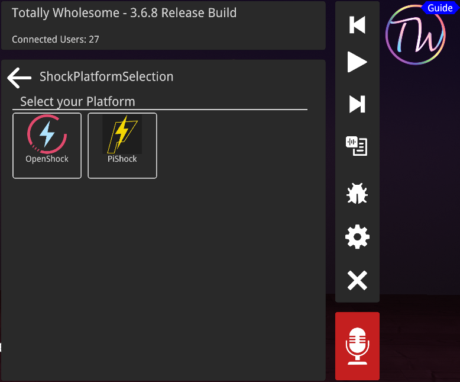
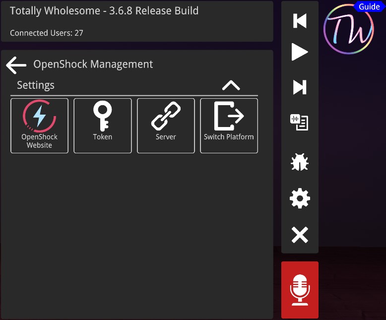
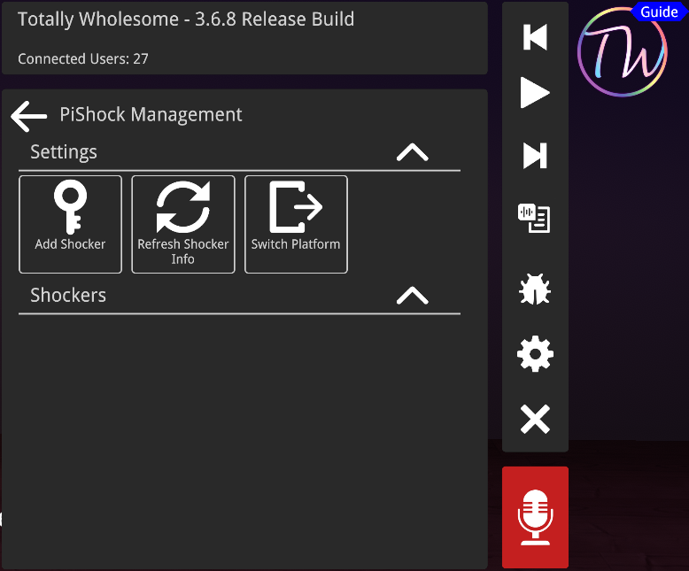

# Shocker Integrations

## Shock Control
If you want to your shock controlled make sure you enable it in the settings

## Control
Each pet can be controlled via the QuickMenu. You wont get any feedbacl if the pet has a shocker connected and allowed control. ~~Well you will probably see a reactionon the pet if it works~~

# TW Shocker Integration Guide - by Keli Kit

## The Setup
> This guide assumes that you have a working/charged shocker and a computer that can **Stably** run the Melonloader mod "TW".

> This guide also assumes you are using a openshock or pishock shocker.

> This guide assumes you have turned on shocker control in the TW settings.

> If your CVR is crashing or your shocker physically isn't working. You should probably get that fixed first.

> ~~*This guide assumes too much*~~

## Shocker -> CVR
Figure out what software you shocker uses then select eaither openshock or pishock platform

## Linking Shocker
Once you find out what your platform is make sure you have your API([OpenShock](https://openshock.app/#/dashboard/tokens)) or Share Code([PiShock](https://pishock.com/#/control)). Once you have the API or Share Code go into TW Settings and down to shock setting.

  
Click To Expand.

